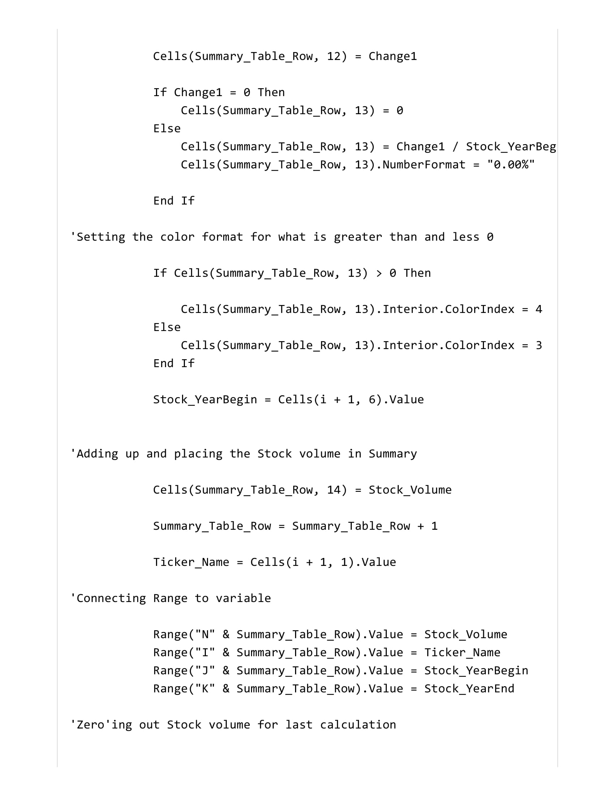
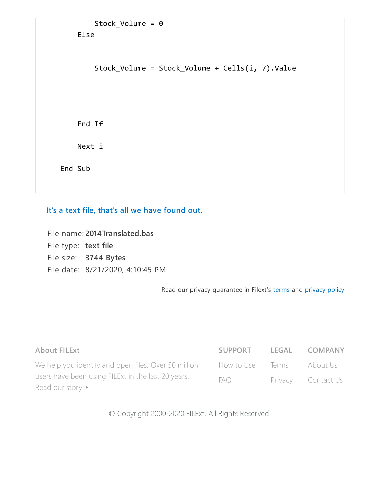
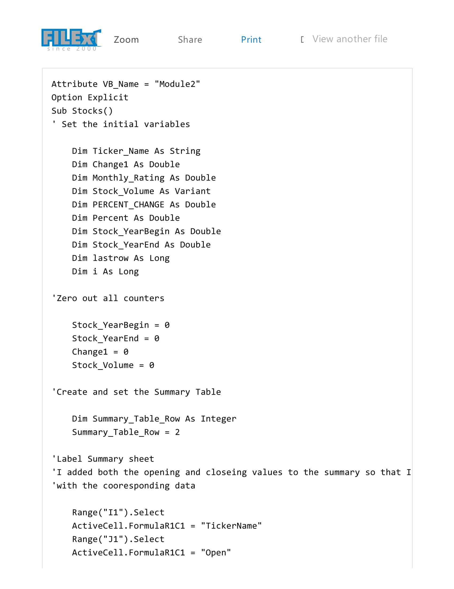
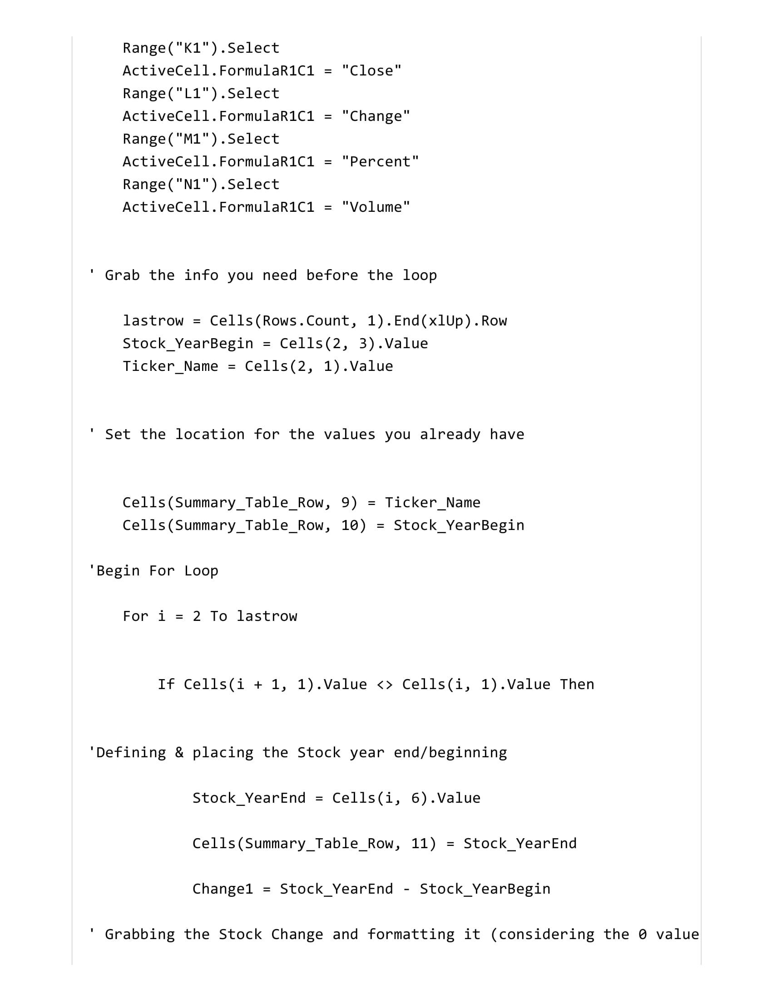
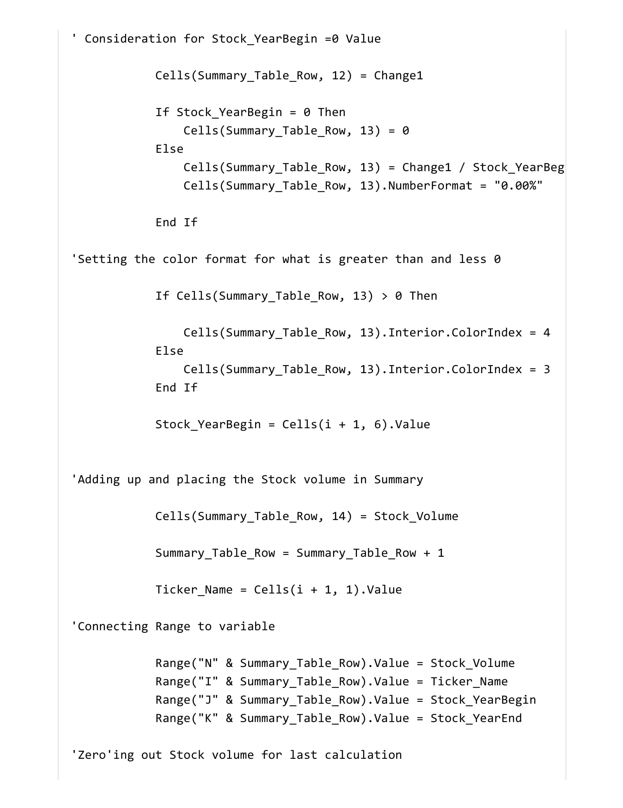
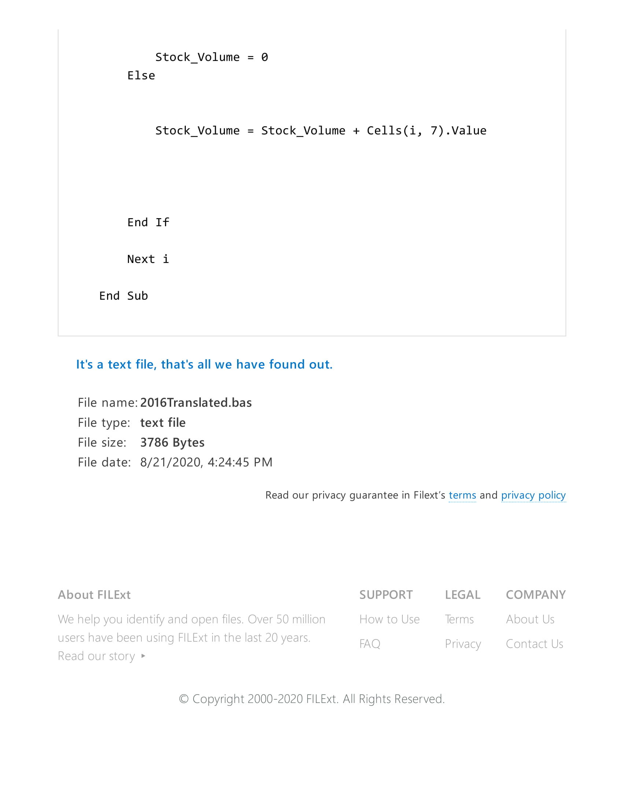

## VBA  - The VBA of Wallstreet

# Script files for each year as well as a screenshot of each year included.
# Goals are listed below.

   * Created a script that will loop through all the stocks for one year and output the following information.

  * The ticker symbol.

  * Yearly change from opening price at the beginning of a given year to the closing price at the end of that year.

  * The percent change from opening price at the beginning of a given year to the closing price at the end of that year.

  * The total stock volume of the stock.

   * Conditional formatting that will highlight positive change in green and negative change in red.

# This is the outcome of 2014 VB script.

# This is the script for the 2015 Stocks

# This is the outcome of the 2015 VB Script.

# This is the script for the 2016 Stocks. 

# This is the outcome of the 2016 VB Script.

## What is a BAS file?
# The BAS file type is primarily associated with BASIC. 

