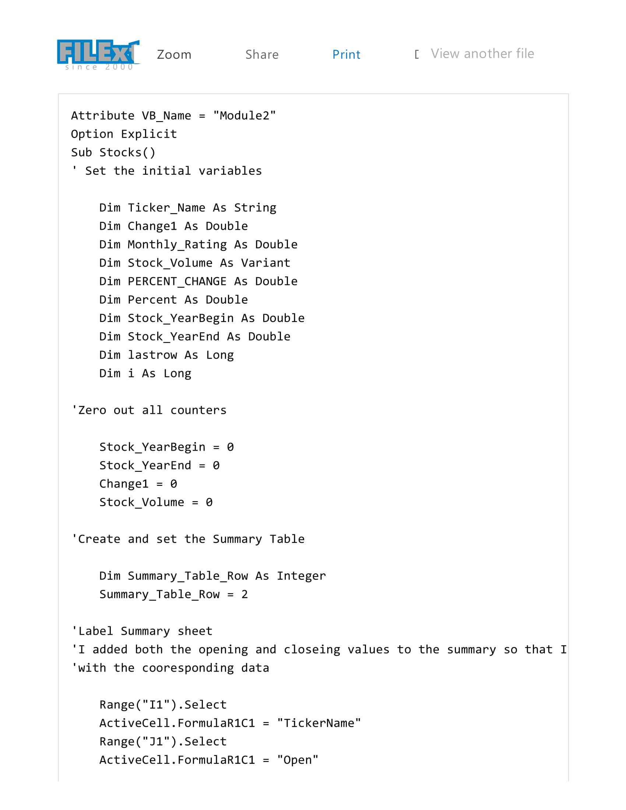
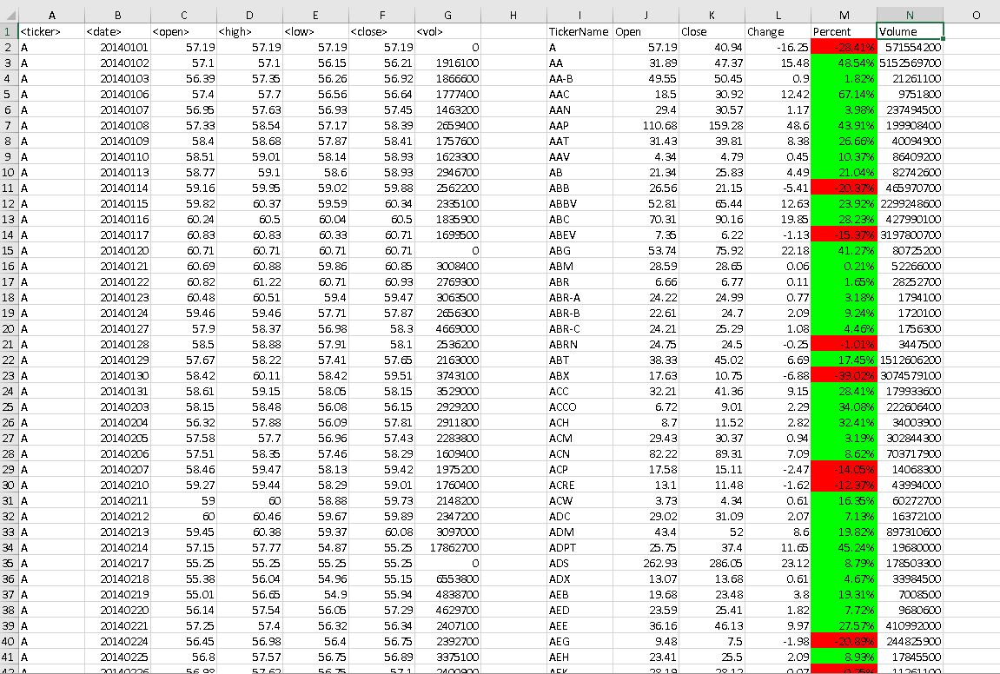
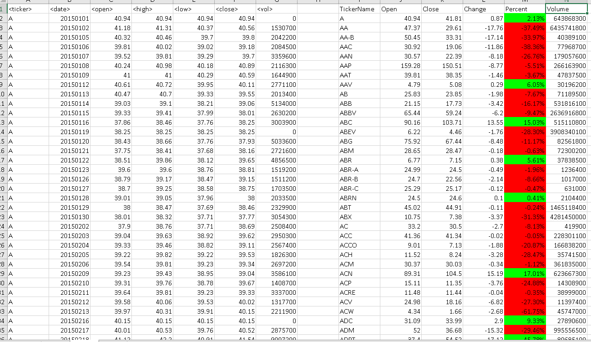
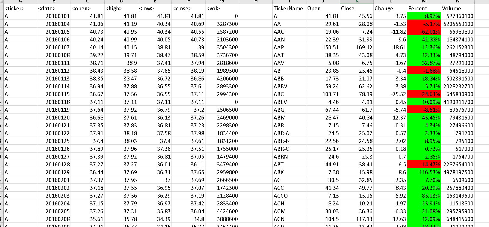

## VBA  - The VBA of Wallstreet

## I only added the opening and ending columns in the summary area so that I could more clearly check my work. 
## Script files for each year are included as well as a screenshot of each year included.

   * Created a script that will loop through all the stocks for one year and output the following information.

  * The ticker symbol.

  * Yearly change from opening price at the beginning of a given year to the closing price at the end of that year.

  * The percent change from opening price at the beginning of a given year to the closing price at the end of that year.

  * The total stock volume of the stock.

   * You should also have conditional formatting that will highlight positive change in green and negative change in red.

## What is a BAS file?
# The BAS file type is primarily associated with BASIC. 

